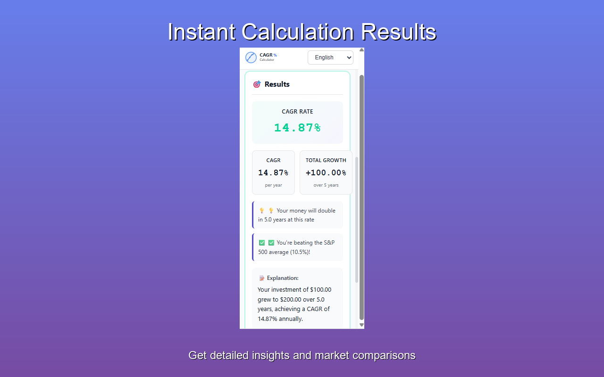

# Smart CAGR Calculator Chrome Extension

[English](README.md) | [简体中文](README.zh-CN.md)

A lightweight Chrome extension for compound annual growth rate calculations.
Enter any three values and the extension solves for the fourth, entirely on
your device.

[](LICENSE)
[](https://chromewebstore.google.com/detail/smart-cagr-calculator/cpbbkfbjhcaompikhekjjfopcecomkao)

## Install

Install the published extension from the
[Chrome Web Store](https://chromewebstore.google.com/detail/smart-cagr-calculator/cpbbkfbjhcaompikhekjjfopcecomkao).

Published version: `1.0.0`



## Features

- Solve for CAGR, final value, initial value, or time period
- Automatically detect which value should be calculated
- Show doubling time, growth summaries, and benchmark comparisons
- Work offline without analytics or telemetry
- Store only your selected language preference locally
- Support English, Simplified Chinese, Spanish, German, Japanese, French,
  Brazilian Portuguese, Korean, and Arabic

## Permissions And Privacy

The extension requests only the `storage` permission. It uses
`chrome.storage.local` to remember your language preference.

Calculations run locally. The extension does not transmit calculation inputs,
results, or browsing data. See the
[extension privacy policy](docs/EXTENSION_PRIVACY_POLICY.md) for details.

## Run From Source

1. Clone the repository:

   ```bash
   git clone https://github.com/chen1360245/chrome-cagr.git
   cd chrome-cagr
   ```

2. Open `chrome://extensions/` in Chrome.
3. Enable **Developer mode**.
4. Select **Load unpacked**.
5. Choose the repository root.

No build step is required.

## Project Structure

```text
_locales/       Chrome i18n translations
icons/          Extension icons
lib/            Calculation and formatting helpers
popup/          Extension interface
manifest.json   Manifest V3 configuration
```

## Related Project

The full web calculator includes charts, educational content, and additional
localized pages:

- Website: [cagrcalculator.app](https://cagrcalculator.app/)
- Web source: [chen1360245/cagr](https://github.com/chen1360245/cagr)

## Package For Release

Create the Chrome Web Store zip locally with the packaging script:

```powershell
./create-zip.ps1
```

Generated zip archives are intentionally ignored by Git.

## Contributing

Issues and pull requests are welcome. For bug reports or feature ideas, open a
[GitHub issue](https://github.com/chen1360245/chrome-cagr/issues).

## License

This project is released under the [MIT License](LICENSE).
